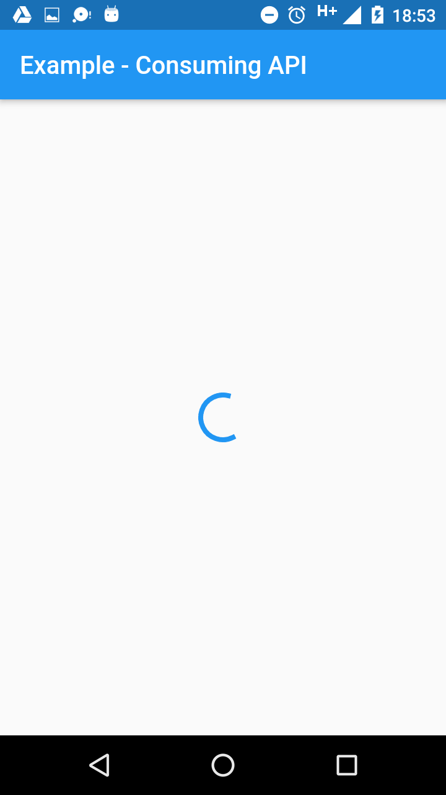
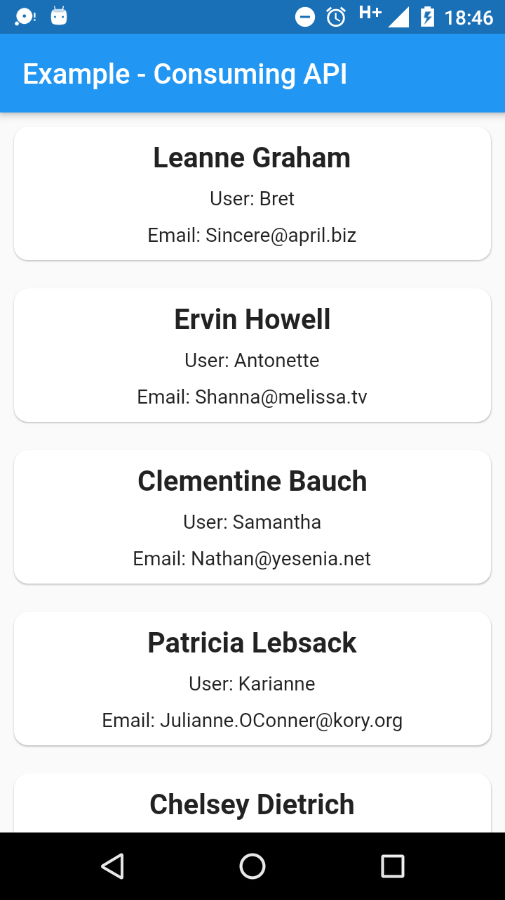
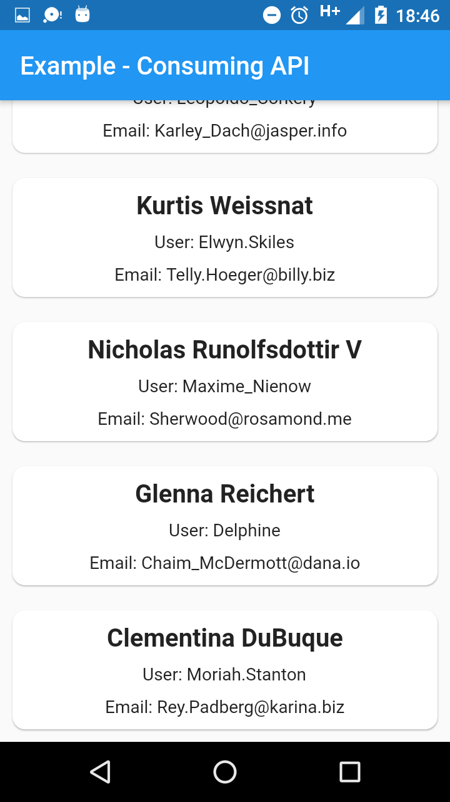
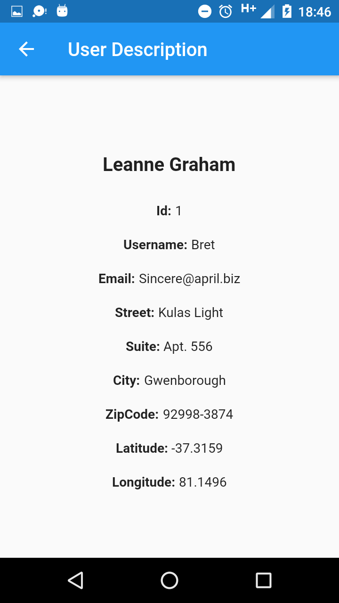
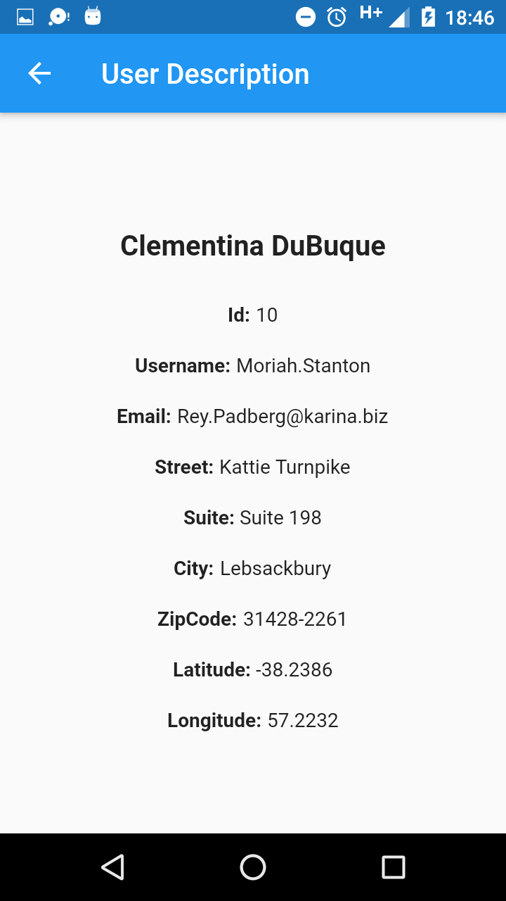

# Exemplo de Consumo de API

Esse projeto foi desenvolvido com a arquitetura <a href="https://github.com/Flutterando/modular" target="_blank">Modular</a>, tendo o <a href="https://medium.com/flutter-comunidade-br/flutter-com-mobx-c0f4762fbd1a" target="_blank">MobX</a> como gerenciador de estado e o <a href="https://github.com/Flutterando/slidy" target="_blank">Slidy</a> como CLI.

Para padronização de commits, foi utilizado o conceito de <a href="https://www.conventionalcommits.org/en/v1.0.0/" target="_blank">Conventional Commits</a>

O intuito era mostrar um exemplo de consumo de API com o Flutter.

Link da API que foi usada no projeto: https://jsonplaceholder.typicode.com/users

## Screenshots

  
  
   
   
   

## Flutter

- [Flutter.dev](https://flutter.dev/)

## Plugins used

- [dio](https://pub.dev/packages/dio): ^3.0.9
- [mobx](https://pub.dev/packages/mobx): ^0.4.0+1
- [flutter_mobx](https://pub.dev/packages/flutter_mobx): ^0.3.6
- [flutter_modular](https://pub.dev/packages/flutter_modular): 0.5.6

## Additional

To contribute, consider these rules:

- https://semver.org/
- https://www.conventionalcommits.org/en/v1.0.0/

## Version

- 1.0.0

## License

Released under the [MIT License](http://opensource.org/licenses/MIT).
